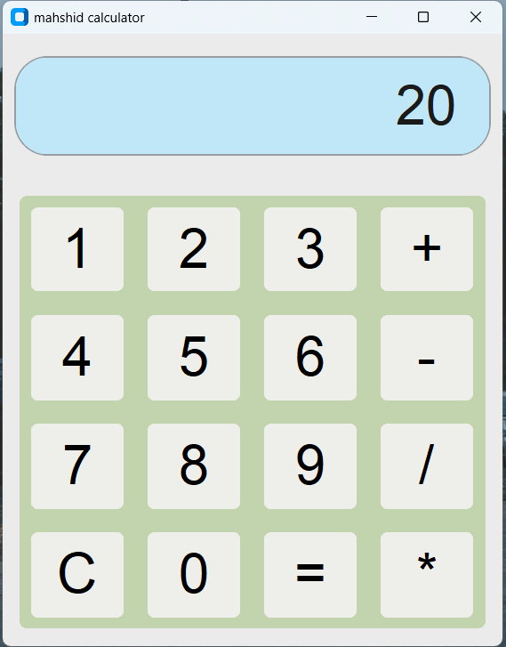

# mahshid-calculator

A basic and responsive calculator built using Python and CustomTkinter.

---

##  Features

- Clean and user-friendly interface
- Supports basic operations: `+`, `-`, `*`, `/`
- Error message for invalid input
- Built with [CustomTkinter](https://github.com/TomSchimansky/CustomTkinter)

---

###  Requirements

- Python 3.10 or higher
- `customtkinter` library

###  Installation & Run

- Download or clone this repository and simply Open terminal and install required library: pip install customtkinter

##  Author

Made by Mahshid 
